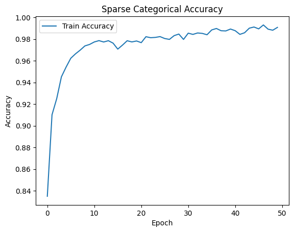
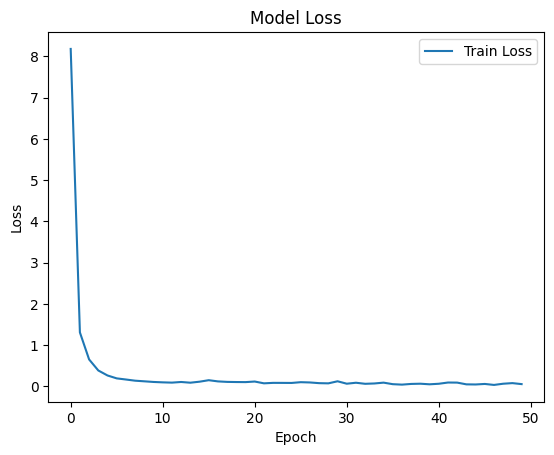
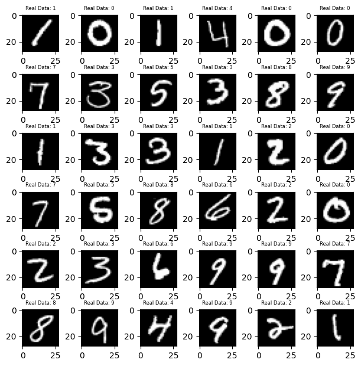
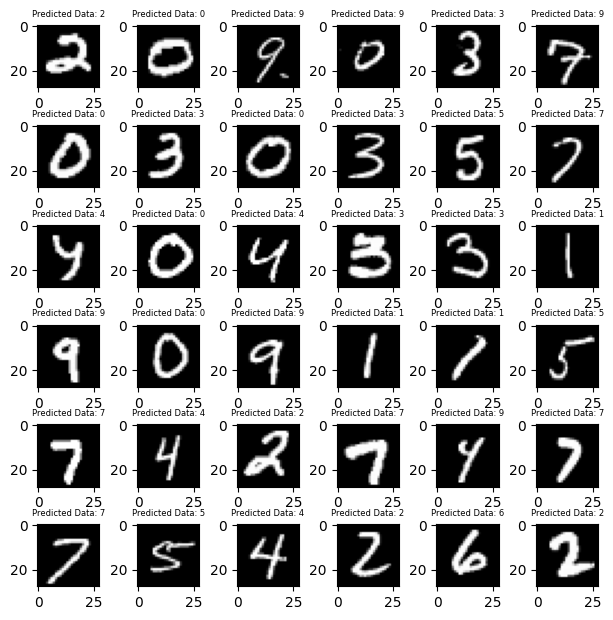

# Yüksek Düzey Programlama - Dönem Ödevi - Digit Recognition

### **Öz**

Bu çalışmada, el yazısı rakamları otomatik olarak tanıyabilen bir görüntü sınıflandırma modeli geliştirilmiştir. Modelin temelinde, görsel verilerden anlamlı özellikler çıkarabilen bir derin öğrenme yöntemi olan **Convolutional Neural Network (CNN)** bulunmaktadır.

28x28 piksellik gri tonlamalı rakam görüntülerinden oluşan veri seti, piksellerin normalizasyonu ve yeniden boyutlandırılması ile model için uygun hale getirilmiştir. Model eğitimi sırasında **Adam optimizasyon algoritması** ve **Sparse Categorical Crossentropy kayıp fonksiyonu** kullanılmıştır. Sonuç olarak, eğitim ve test veri setlerinde yüksek doğruluk oranları elde edilmiştir.

### **Giriş**

Bu projede, el yazısı rakamların doğru bir şekilde tanınmasını sağlayan bir CNN modeli geliştirilmiştir. CNN, görsellerdeki pikseller arası ilişkileri öğrenip analiz ederek, veri sınıflandırmasını etkili bir şekilde gerçekleştirmektedir.

### **Materyal ve Metot**

### Veri Seti

Çalışmada, Kaggle platformundan alınan **Digit Recognizer** veri seti kullanılmıştır. Veri seti:

- **train.csv**: Etiketlenmiş 42.000 el yazısı rakamı (0-9) içerir.
- **test.csv**: 28.000 etiketsiz görüntü içerir. Modelin doğruluğunu test etmek için kullanılır.

Veriler, her biri 28x28 piksel boyutunda gri tonlamalı rakam görüntülerinden oluşmaktadır. Eğitim için verilerde bölümleme yapılmamış, tüm **train.csv** dosyası kullanılmıştır.

### Model Eğitimi

- Modelde **Convolutional Neural Network (CNN)** mimarisi kullanılmıştır.
- Eğitim sürecinde:
    - **Adam optimizasyon algoritması** ile model hızla optimize edilmiştir.
    - **Sparse Categorical Crossentropy** kayıp fonksiyonu ile doğruluk oranı ölçülmüştür.
- 50 Epoch boyunca model eğitilmiş ve eğitim sürecinde doğruluk oranı sürekli artmıştır.

CNN model mimarisi aşağıdaki şekilde tanımlanmış, ardından optimizasyon algoritması dahil edilip derlenmiştir:

```python
model = tf.keras.models.Sequential([
  tf.keras.layers.Flatten(input_shape=(784,)),
  tf.keras.layers.Dense(128, activation='relu'),
  tf.keras.layers.Dense(10) # 10 sayi var.
])

model.compile(
    optimizer=tf.keras.optimizers.Adam(0.001),
    loss=tf.keras.losses.SparseCategoricalCrossentropy(from_logits=True),
    metrics=[tf.keras.metrics.SparseCategoricalAccuracy()],
)
```

**Sonuçlar**

### Eğitim Performansı

CNN modeli, eğitim veri setinde %99,76 doğruluk oranına ulaşmıştır. Eğitim sürecine ait kayıp ve doğruluk grafikleri aşağıdaki gibidir:





### Test Performansı

Model, test veri setinde %98,53 doğruluk oranına ulaşmıştır.

### Gerçek Veri ve Tahmin Edilen Verilerin Görsel Çıktısı

Gerçek Veri:



Tahmin Edilen Veri:


